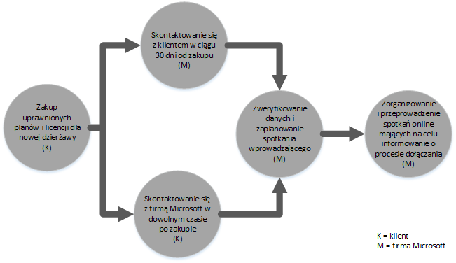
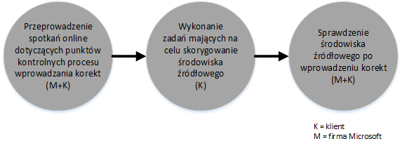
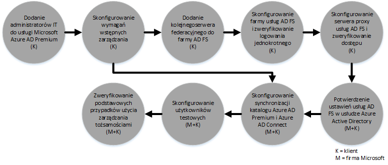

# Proces świadczenia asysty centrum rozwiązania FastTrack dla usługi Azure Active Directory Premium 
Jeśli Twoja organizacja jest uprawniona do asysty centrum rozwiązania FastTrack dla usługi Microsoft Azure AD Premium, możesz podjąć zdalną współpracę ze specjalistami z firmy Microsoft w celu przygotowania środowiska usługi Microsoft Azure AD Premium do użycia. Aby dowiedzieć się, czy Twoja organizacja jest uprawniona, zobacz [Asysta centrum rozwiązania FastTrack dla usługi Azure Active Directory Premium](../Topic/FastTrack_Center_Benefit_for_Azure_Active_Directory_Premium.md).

Ten artykuł zawiera następujące informacje:

-   [Overview of the onboarding process](#overview)

-   [Expectations for your source environment](#expectations_src_environ)

-   [Phases of the onboarding process](#phases_onboarding_process)

-   [Microsoft responsibilities](#microsoft_responsibilities) — dla każdej fazy

-   [Your responsibilities](#your_responsibilities) — dla każdej fazy

Czego można oczekiwać po zakończeniu dołączania:

-   Zostanie utworzona dzierżawa usługi Microsoft Azure AD Premium.

-   Licencjonowani użytkownicy będą mieli dostęp do usług Microsoft Azure AD Premium za pomocą jednej z następujących opcji tożsamości:

    -   Tożsamości w chmurze (unikatowe konta usługi Microsoft Azure AD Premium).

    -   Tożsamości synchronizowane: konta usługi Microsoft Azure AD Premium synchronizowane z lokalną usługą Active Directory za pomocą narzędzia Azure Active Directory Connect (Azure AD Connect) w przypadku klientów z pojedynczym lasem lub wieloma lasami usługi Active Directory.

    -   Tożsamości federacyjne — z kontami usługi Microsoft Azure AD Premium, które są:

        -   Synchronizowane z usługą Active Directory za pomocą narzędzia Microsoft Azure AD Connect w przypadku klientów używających konfiguracji z pojedynczym lasem usługi Active Directory.

        -   Federowane za pomocą usług Active Directory Federation Services (AD FS) 2.0 lub nowszych z lokalnej usługi Active Directory.

## Omówienie procesu dołączania
Oto dwa istotne etapy procesu dołączania:

-   **Podstawowe możliwości** — zadania wymagane w celu skonfigurowania dzierżawy i zintegrowania z usługą Azure AD, jeśli to konieczne. Funkcje podstawowe stanowią też bazę dla dołączania innych kwalifikujących się usług online firmy Microsoft.

-   **Dołączanie do usługi** — zadania wymagane do skonfigurowania autonomicznej usługi Microsoft Azure AD Premium albo usługi korzystającej z synchronizacji z katalogiem za pomocą narzędzia Azure AD Connect bądź usług AD FS.

Na poniższym diagramie przedstawiono oś czasu dla używania asysty centrum rozwiązania FastTrack.

Podstawowy proces przebiega w następujący sposób:

-   Firma Microsoft podejmie próbę skontaktowania się z Tobą w ciągu 30 dni od daty zakupu uprawniającego planu. Możesz również poprosić o pomoc z [centrum rozwiązania FastTrack](http://fasttrack.microsoft.com/), gdy wszystko będzie gotowe do wdrożenia tych usług w Twojej organizacji. Aby poprosić o pomoc, zaloguj się do centrum rozwiązania FastTrack (http://fasttrack.microsoft.com), przejdź do pulpitu nawigacyjnego, wybierz nazwę firmy, kliknij kartę Oferty i kliknij przycisk prośby o pomoc w ramach kwalifikującej się usługi. Po rozpoczęciu świadczenia pomocy technicznej dotyczącej dołączania ustalimy harmonogram spotkań online.

-   Zespół firmy Microsoft pomoże Ci na etapie podstawowych możliwości, a następnie pomoże Ci dołączyć jeden raz do każdej z kwalifikujących się usług.

Pomoc techniczna dotycząca dołączania będzie świadczona w całości zdalnie przez przydzielony do tego personel firmy Microsoft:

-   Firma Microsoft będzie zdalnie pomagać Ci w różnych działaniach związanych z dołączaniem za pomocą narzędzi, dokumentacji i wskazówek. Jeśli chcesz, aby pracownicy firmy Microsoft wykonali za Ciebie niektóre zadania konfiguracyjne, możesz nadać firmie Microsoft prawa dostępu i inne uprawnienia niezbędne do realizacji tych zadań.

-   Pomoc techniczna dotycząca dołączania jest świadczona przez centrum programu FastTrack w normalnych godzinach pracy dla danego regionu.

-   Pomoc techniczna dotycząca dołączania jest dostępna w następujących językach: angielski, chiński (uproszczony), francuski, hiszpański, japoński, niemiecki, portugalski (Brazylia) i włoski.

-   Zespół firmy Microsoft może współpracować bezpośrednio z Tobą lub Twoim przedstawicielem.

## Oczekiwania dotyczące środowiska źródłowego
W środowisku źródłowym może już istnieć lokalna usługa Microsoft Active Directory, którą chcesz zintegrować z usługą Microsoft Azure AD Premium, aby umożliwić zaawansowane zarządzanie tożsamościami z poziomu pojedynczej konsoli. Asysta centrum rozwiązania FastTrack obejmuje pomoc w integracji usługi Microsoft Azure AD Premium z istniejącą implementacją lokalną. Jeśli wymagana jest integracja, środowisko źródłowe musi działać co najmniej na poziomie minimalnym dla danego zastosowania.

W poniższej tabeli przedstawiono oczekiwania dotyczące istniejącego środowiska źródłowego związane z dołączaniem.

|Aktywność|Oczekiwania dotyczące środowiska źródłowego|
|-------------|-----------------------------------------------|
|Podstawowe możliwości|Lasy usługi Active Directory z ustawionym poziomem funkcjonalności lasu co najmniej systemu Windows Server 2008 i następującą konfiguracją lasów:  -   Pojedynczy las usługi Active Directory -   Wiele lasów usługi Active Directory **Note:** W przypadku wszystkich konfiguracji z wieloma lasami wdrożenie usług AD FS wykracza poza zakres asysty centrum rozwiązania FastTrack.|
|Etap dołączania do usługi  -   Microsoft Azure AD Premium|Lokalna usługa Active Directory i lokalne środowisko zostały przygotowane na potrzeby usługi Azure AD Premium, co obejmuje skorygowanie zidentyfikowanych problemów, które uniemożliwiłyby integrację z funkcjami usługi Azure AD i Azure AD Premium.|

## Fazy procesu dołączania
Dołączanie do usługi Microsoft Azure AD Premium składa się z pięciu podstawowych faz, jak pokazano na poniższej ilustracji:

-   Inicjowanie

-   Ocena

-   Korygowanie

-   Włączenie

-   Zamknij

Aby poznać szczegóły zadań realizowanych w każdej fazie, zobacz sekcje [Microsoft responsibilities](#microsoft_responsibilities) i [Your responsibilities](#your_responsibilities).

### Faza inicjowania
Po zakupie odpowiedniej liczby licencji postępuj zgodnie ze wskazówkami zawartymi w wiadomości e-mail z potwierdzeniem zakupu w celu skojarzenia licencji z istniejącą lub nową dzierżawą. Firma Microsoft zweryfikuje Twoje uprawnienia do asysty centrum rozwiązania FastTrack. Firma Microsoft podejmie próbę skontaktowania się z Tobą w ciągu 30 dni od daty zakupu uprawniającego planu. Możesz również poprosić o pomoc z [centrum rozwiązania FastTrack](http://fasttrack.microsoft.com/), gdy wszystko będzie gotowe do wdrożenia tych usług w Twojej organizacji. Aby poprosić o pomoc, zaloguj się do centrum rozwiązania FastTrack (http://fasttrack.microsoft.com), przejdź do pulpitu nawigacyjnego, wybierz nazwę firmy, kliknij kartę Oferty i kliknij przycisk prośby o pomoc w ramach kwalifikującej się usługi. Po rozpoczęciu świadczenia pomocy technicznej dotyczącej dołączania ustalimy harmonogram spotkań online.

W tej fazie omówimy proces dołączania, zweryfikujemy dane i zorganizujemy spotkanie wstępne.

### Faza oceny
Po rozpoczęciu procesu dołączania firma Microsoft we współpracy z Tobą oceni Twoje środowisko źródłowe i wymagania. Zostaną uruchomione narzędzia umożliwiające ocenę środowiska i firma Microsoft przeprowadzi Cię przez proces oceny lokalnej usługi Active Directory, przeglądarek internetowych, systemów operacyjnych na urządzeniach klienckich, usługi DNS, sieci, infrastruktury i systemu tożsamości w celu ustalenia, czy ze względu na dołączenie są wymagane zmiany. Na podstawie bieżącej konfiguracji udostępnimy plan korekt pozwalających zapewnić spełnienie przez środowisko źródłowe minimalnych wymagań na potrzeby pomyślnego dołączenia do usługi Microsoft Azure AD Premium. Zaplanujemy też odpowiednie rozmowy kontrolne do przeprowadzenia w fazie korygowania.

### Faza korygowania
Jeśli będzie to konieczne, wykonasz ustalone w planie korekt zadania w środowisku źródłowym, aby zapewnić spełnienie minimalnych wymagań na potrzeby dołączenia do poszczególnych usług.

Przed rozpoczęciem fazy włączania wspólnie zweryfikujemy wyniki działań korygujących, aby upewnić się, że wszystko jest gotowe do kontynuacji.

### Faza włączania
Po ukończeniu wszystkich działań korygujących projekt przewiduje skonfigurowanie w infrastrukturze podstawowej korzystania z usług i zainicjowanie obsługi usługi Microsoft Azure AD Premium.

**Faza włączania — podstawowe możliwości**

Włączanie podstawowych możliwości obejmuje zainicjowanie obsługi usług oraz zintegrowanie dzierżawy i tożsamości. Obejmuje on też kroki utworzenia podstaw do dołączenia do usługi Microsoft Azure AD Premium.

Po zakończeniu etapu podstawowego dołączania można rozpocząć dołączanie do usługi Microsoft Azure AD Premium.

**Faza włączania — Microsoft Azure AD Premium**

Środowisko usługi Microsoft Azure AD Premium można skonfigurować pod kątem synchronizacji z katalogiem narzędzia Azure AD Connect i Usług federacyjnych Active Directory (AD FS).

W przypadku scenariuszy Microsoft Azure AD Premium obejmujących synchronizowanie tożsamości lokalnych z chmurą pomożemy Ci przez dodanie użytkowników i administratorów IT do Twojej subskrypcji, skonfigurowanie wymagań wstępnych zarządzania, skonfigurowanie usługi Microsoft Azure AD Premium, skonfigurowanie synchronizacji katalogu i usług Active Directory Federation Services przy użyciu narzędzia Azure AD Connect, skonfigurowanie użytkowników testowych i zweryfikowanie podstawowych zastosowań usługi.

Konfiguracja usługi Microsoft Azure AD Premium obejmuje włączenie następujących funkcji:

-   Samodzielne resetowanie haseł

-   Azure Multi-Factor Authentication (MFA)

-   Aplikacja typu „oprogramowanie jako usługa” (SaaS) — konfigurowanie jednej aplikacji SaaS

-   Samodzielne zarządzanie grupami

-   Raporty administracyjne

## Obowiązki firmy Microsoft:

### Ogólne

-   Zapewnianie Ci zdalnej pomocy technicznej w zakresie wymaganych działań konfiguracyjnych zgodnie z informacjami podanymi w szczegółowych opisach faz.

-   Zapewnianie dostępnej dokumentacji i narzędzi programowych, konsol administracyjnych i skryptów ułatwiających ograniczenie lub wyeliminowanie zadań konfiguracji.

Nadanie firmie Microsoft praw dostępu i innych uprawnień nie jest wymagane do korzystania z asysty centrum rozwiązania FastTrack. W niektórych przypadkach możesz podjąć decyzję o nadaniu firmie Microsoft praw dostępu i innych uprawnień w celu wykonania określonych działań w Twoim imieniu.

### Faza inicjowania

-   Skontaktowanie się z Tobą w ciągu 30 dni od zakupu uprawniających licencji dla nowej dzierżawy.

-   Współpraca z Tobą w celu rozpoczęcia dołączania w ciągu 90 dni od zakupu uprawniających licencji.

-   Zdefiniowanie kwalifikujących się usług, do których chcesz dołączyć.

### Faza oceny

-   Zapewnianie przeglądu administracyjnego.

-   Zapewnianie wskazówek w następującym zakresie:

    -   Wymagania związane z usługą DNS, siecią i infrastrukturą.

    -   Wymagania związane z klientami (przeglądarka internetowa, kliencki system operacyjny i potrzeby związane z usługami).

    -   Inicjowanie obsługi i tożsamości użytkowników.

    -   Identyfikacja wymagań synchronizacji katalogu.

    -   Określanie, czy synchronizacja skrótów haseł spełnia cele klienta, czy są wymagane usługi AD FS.

    -   Włączanie kwalifikujących się usług, które zostały zakupione i zdefiniowane jako część procesu dołączania.

    -   Identyfikacja wymagań środowiska pilotażowego i testowego, takich jak konta testowe i testowe wystąpienie aplikacji SaaS (np. SalesForce).

-   Ustalenie osi czasu działań korygujących.

-   Udostępnienie listy korekt.

### Faza korygowania

-   Prowadzenie z Tobą rozmów konferencyjnych zgodnie z ustalonym harmonogramem w celu monitorowania postępu działań korygujących.

-   Pomoc przy korzystaniu z narzędzi identyfikujących i korygujących problemy oraz przy interpretowaniu wyników.

### Faza włączania
Zapewnianie wskazówek w następującym zakresie:

-   Aktywowanie dzierżawcy usługi Microsoft Azure AD Premium.

-   Konfigurowanie portów zapory.

-   Konfigurowanie usługi DNS dla kwalifikujących się usług.

-   Weryfikowanie łączności z usługami Microsoft Azure AD Premium.

-   W przypadku środowiska z jednym lasem:

    -   Wdrażanie synchronizacji katalogu między Usługami domenowymi Active Directory a narzędziem Azure AD Connect, jeśli jest to wymagane.

    -   Konfigurowanie synchronizacji haseł za pomocą narzędzia Azure AD Connect.

-   W przypadku środowiska z wieloma lasami:

    -   Wdrażanie synchronizacji za pomocą narzędzia Azure AD Connect skonfigurowanej na potrzeby scenariuszy z wieloma lasami. Pamiętaj, że funkcje synchronizacji skrótów haseł i zapisywania zwrotnego haseł obsługują wiele lasów.  Jednak inne scenariusze zapisywania zwrotnego nie są obsługiwane.

    -   Konfigurowanie synchronizacji między lokalnymi lasami usługi Active Directory a katalogiem usługi Microsoft Azure AD Premium (Azure Active Directory).

        > [!NOTE]
        > Projektowanie i wdrażanie rozwiązań niestandardowych rozszerzeń reguł wykracza poza zakres tej asysty.

-   W przypadku pojedynczego lasu, gdy obiektem docelowym są tożsamości federacyjne: instalowanie i konfigurowanie Usług federacyjnych Active Directory (AD FS) na potrzeby uwierzytelniania domeny lokalnej za pomocą usługi Microsoft Azure AD Premium w odpornej na uszkodzenia konfiguracji pojedynczej lokacji, jeśli jest to wymagane.

    > [!NOTE]
    > W przypadku wszystkich konfiguracji z wieloma lasami wdrożenia usług AD FS wykraczają poza zakres tej asysty.

-   Testowanie funkcji logowania jednokrotnego, jeśli ją wdrożono.

#### Faza włączania — usługa Azure AD Premium z narzędziem Azure AD Connect i usługami AD FS
Zapewnianie wskazówek w zakresie konfiguracji następujących funkcji:

-   Inicjowanie obsługi użytkowników, w tym licencjonowanie.

-   Synchronizacja katalogu Azure AD Connect (z zapisywaniem zwrotnym haseł i synchronizacją skrótów haseł).

-   Active Directory Federation Services (AD FS).

-   Samodzielne resetowanie haseł.

-   Azure Multi-Factor Authentication (MFA).

-   Jedna zintegrowana aplikacja, która może obejmować logowanie jednokrotne dla aplikacji SaaS.

-   Raporty o użyciu i zabezpieczeniach dla administratorów.

-   Samodzielne zarządzanie grupami.

-   Serwer proxy aplikacji.

-   Powiadomienia administratora.

-   Dostosowany ekran logowania, w tym logo, tekst i obrazy.

## Twoje obowiązki
W tej sekcji opisano niektóre z Twoich obowiązków podczas procesu dołączania.

### Ogólne

-   Wprowadzanie wszelkich ulepszeń i integracji w dzierżawcy usługi Microsoft Azure AD Premium, które wykraczają poza konfigurowalne opcje wymienione w tym artykule.

-   Ogólne zarządzanie programem i projektami w zakresie Twoich zasobów.

-   Komunikowanie się z użytkownikami końcowymi, przygotowywanie dokumentacji i szkoleń oraz zarządzanie zmianami.

-   Dokumentacja pomocy dla użytkowników i szkolenia.

-   Tworzenie wszelkich raportów, prezentacji lub protokołów spotkań specyficznych dla Twojej organizacji.

-   Tworzenie dokumentacji dotyczącej architektury i technicznej specyficznej dla Twojej organizacji.

-   Projektowanie, nabywanie, instalowanie i konfigurowanie sprzętu oraz sieci.

-   Nabywanie, instalowanie i konfigurowanie oprogramowania.

-   Konfigurowanie i stosowanie zasad zabezpieczeń innych niż utworzone na potrzeby testowania konfiguracji i funkcjonalności podstawowej usług Microsoft Azure AD Premium oraz zarządzanie tymi zasadami.

-   Rejestrowanie kont użytkowników innych niż te wykorzystywane do testowania konfiguracji i funkcjonalności podstawowej usług Microsoft Azure AD Premium.

-   Analiza, weryfikowanie przepustowości, testowanie, monitorowanie i konfigurowanie sieci.

-   Zarządzanie procesem zatwierdzania zarządzania zmianami technicznymi i tworzenie odpowiedniej dokumentacji.

-   Modyfikowanie modelu operacyjnego i wytycznych operacyjnych.

-   Konfigurowanie lokalnego uwierzytelniania wieloskładnikowego.

-   Wycofywanie z eksploatacji i usuwanie środowisk źródłowych oraz usług używanych wcześniej przez klienta.

-   Konstruowanie i obsługa środowiska testowego.

-   Instalowanie dodatków Service Pack i innych wymaganych aktualizacji na serwerach infrastruktury.

-   Zapewnianie i konfigurowanie wszelkich publicznych certyfikatów SSL.

-   Redagowanie warunków użytkowania Twojej organizacji do skonfigurowania i wyświetlania na urządzeniach należących do użytkowników końcowych.

### Faza inicjowania

-   Współpraca z zespołem firmy Microsoft w celu rozpoczęcia dołączania kwalifikujących się usług.

-   Udział w spotkaniu wstępnym, zarządzanie uczestnikami z Twojej organizacji i przewodzenie im oraz potwierdzanie osi czasu korygowania.

### Faza oceny

-   Wskazanie odpowiednich osób biorących udział w projekcie (w tym kierownika) na potrzeby zrealizowania niezbędnych działań oceny.

-   Jeśli wybierzesz takie rozwiązanie, udostępnienie ekranu firmie Microsoft w celu uzyskania wskazówek podczas uruchamiania narzędzi oceniających Twoje środowisko lub subskrypcję usługi Microsoft Azure AD Premium.

-   Uczestniczenie w spotkaniach w celu utworzenia listy korekt i przygotowania ogólnego planu dotyczącego między innymi infrastruktury, sieci, administracji, przygotowania synchronizacji katalogów, zabezpieczeń sieci i tożsamości federacyjnych.

-   Uczestniczenie w spotkaniach w celu ustalenia sposobu inicjowania obsługi użytkowników.

-   Uczestniczenie w spotkaniach w celu zaplanowania konfiguracji usług online.

-   Tworzenie planu pomocy technicznej w celu zapewnienia gotowości na migrację.

### Faza korygowania

-   Wykonywanie czynności wymaganych do ukończenia działań korygowania zidentyfikowanych w fazie oceny.

-   Uczestniczenie w spotkaniach kontrolnych.

### Faza włączania

-   Jeśli wybierzesz taką opcję, udostępnianie ekranu firmie Microsoft w celu uzyskania wskazówek podczas wprowadzania zmian w Twoim środowisku lub subskrypcji usługi Microsoft Azure AD Premium.

-   Odpowiednie zarządzanie zasobami.

-   Konfigurowanie elementów związanych z siecią zgodnie ze wskazówkami firmy Microsoft.

-   Przygotowywanie katalogów i konfigurowanie synchronizacji katalogów zgodnie ze wskazówkami firmy Microsoft.

-   Konfigurowanie infrastruktury związanej z zabezpieczeniami (na przykład portów zapory) zgodnie ze wskazówkami firmy Microsoft.

-   Wdrażanie odpowiedniej infrastruktury klienckiej.

-   Wdrażanie rozwiązania inicjowania obsługi użytkowników zgodnie ze wskazówkami firmy Microsoft.

-   Włączanie różnych usług zgodnie ze wskazówkami firmy Microsoft.

## Chcesz dowiedzieć się więcej?
Zobacz [Microsoft Azure Active Directory](http://azure.microsoft.com/en-us/documentation/services/active-directory/) i [Enterprise Mobility Suite](http://www.microsoft.com/en-us/server-cloud/products/enterprise-mobility-suite/default.aspx).

