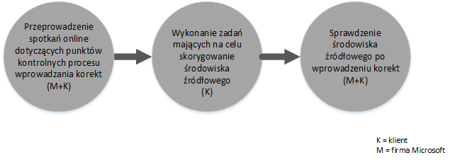

# Proces świadczenia asysty centrum rozwiązania FastTrack dla usługi Intune
Jeśli Twoja organizacja jest uprawniona do asysty serwisowej dla usługi Microsoft Intune, możesz podjąć zdalną współpracę ze specjalistami firmy Microsoft w celu przygotowania swojego środowiska usługi Microsoft Intune do użycia.

Usługa Microsoft Intune jest częścią pakietu Microsoft Enterprise Mobility Suite (EMS), która udostępnia możliwości zarządzania mobilnością w przedsiębiorstwie (EMM), w tym zarządzania urządzeniami przenośnymi (MDM) i zarządzania aplikacjami mobilnymi (MAM).  Usługa Microsoft Intune umożliwia pracownikom efektywną pracę na urządzeniach przenośnych przez inicjowanie obsługi urządzeń, konfigurowanie urządzeń i wdrażanie aplikacji mobilnych.  Usługa Microsoft Intune umożliwia również ochronę danych firmowych przez monitorowanie zgodności urządzeń oraz ochronę danych i aplikacji mobilnych, a także integrację z usługą Azure AD na potrzeby kontrolowania dostępu do usług firmowych.

Aby dowiedzieć się, czy Twoja organizacja jest uprawniona, zobacz [Asysta centrum rozwiązania FastTrack dla usługi Intune](../Topic/FastTrack_Center_Benefit_for_Intune.md). Jeśli interesuje Cię przygotowanie środowiska pod kątem innych usług pakietu Enterprise Mobility Suite, zobacz [Asysta centrum rozwiązania FastTrack dla pakietu Enterprise Mobility Suite](../Topic/FastTrack_Center_Benefit_for_Enterprise_Mobility_Suite.md).

**Szukasz informacji o programie Microsoft FastTrack dla usługi Office 365? Zobacz** [Asysta centrum rozwiązania FastTrack dla usługi Office 365](https://technet.microsoft.com/library/office-365-onboarding-benefit.aspx).

Ten artykuł zawiera następujące informacje dotyczące asysty serwisowej dla usługi Microsoft Intune:

-   [Overview of the onboarding process](#overview_onboarding_process)

-   [Expectations for your source environment](#expectations_src_environ)

-   [Phases of the onboarding process](#phases_onboarding_process)

-   [Microsoft responsibilities](#microsoft_responsibilities) — dla każdej fazy

-   [Your responsibilities](#your_responsibilities) — dla każdej fazy

Czego można oczekiwać po zakończeniu dołączania:

-   Utworzona zostanie dzierżawa usługi online firmy Microsoft.

-   Licencjonowani użytkownicy będą mieli dostęp do usługi Microsoft Intune za pomocą jednej z następujących opcji tożsamości:

    -   Tożsamości w chmurze (unikatowe konta usługi online firmy Microsoft).

    -   Tożsamości synchronizowane: konta usługi Microsoft Intune synchronizowane z lokalną usługą Active Directory za pomocą narzędzia Azure Active Directory Connect (usług synchronizacji):

        -   W przypadku klientów z jednym środowiskiem lasu usługi Active Directory.

        -   W przypadku klientów z obsługiwaną topologią wielu lasów usługi Active Directory.

-   Tożsamości federacyjne — konta Microsoft Intune:

    -   Synchronizowane z usługą Active Directory za pomocą narzędzia Microsoft Azure Active Directory Connect w przypadku klientów z pojedynczą konfiguracją lasu usługi Active Directory lub w przypadku klientów z pojedynczym lasem kont usługi Active Directory (znanym także jako las logowania) i pojedynczą konfiguracją lasu zasobów usługi Active Directory.

    -   Federacja z lokalną usługą Active Directory za pomocą roli Active Directory Federation Services dla systemu Windows Server 2012 R2 albo usług Active Directory Federation Services (AD FS) 2.0 lub nowszych.

## Omówienie procesu dołączania
Oto dwa istotne etapy procesu dołączania:

-   **Podstawowe możliwości** — zadania wymagane w celu skonfigurowania dzierżawy i zintegrowania z usługą Azure AD, jeśli to konieczne. Etap podstawowych możliwości stanowi też bazę do dołączenia do innych kwalifikujących się usług.

-   **Etap dołączania do usługi** — zadania wymagane w celu skonfigurowania usługi Microsoft Intune.

Na poniższym wykresie przedstawiono sekwencję zdarzeń korzystania z asysty centrum rozwiązania FastTrack.

Podstawowy proces przebiega w następujący sposób:

-   Centrum rozwiązania FastTrack podejmie próbę skontaktowania się z Tobą w ciągu 30 dni od daty zakupu uprawniającego planu. Możesz również poprosić o pomoc z [centrum rozwiązania FastTrack](http://fasttrack.microsoft.com/), gdy wszystko będzie gotowe do wdrożenia tych usług w Twojej organizacji. Aby zażądać pomocy, zaloguj się do [centrum rozwiązania FastTrack](http://fasttrack.microsoft.com/), przejdź do pulpitu nawigacyjnego, wybierz nazwę Twojej firmy, kliknij kartę Oferty i kliknij przycisk Poproś o pomoc, zwracając się w ten sposób o pomoc dla usługi Microsoft Intune, usługi Azure Active Directory w warstwie Premium lub usługi Azure Rights Management w warstwie Premium.

-   Centrum rozwiązania FastTrack udzieli Ci pomocy dla podstawowych możliwości, a następnie pomoże Ci dołączyć — jeden raz — każdą z kwalifikujących się usług.

Pomoc techniczna dotycząca dołączania będzie świadczona w całości zdalnie przez przydzielony do tego personel firmy Microsoft:

-   Firma Microsoft będzie zdalnie pomagać Ci w różnych działaniach związanych z dołączaniem za pomocą narzędzi, dokumentacji i wskazówek.

-   Pomoc techniczna dotycząca dołączania jest świadczona przez centrum programu FastTrack w normalnych godzinach pracy dla danego regionu.

-   Pomoc techniczna dotycząca dołączania jest dostępna w następujących językach: angielski, chiński (uproszczony), francuski, hiszpański, japoński, niemiecki, portugalski (Brazylia) i włoski.

-   Zespół firmy Microsoft może współpracować bezpośrednio z Tobą lub Twoim przedstawicielem.

## Oczekiwania dotyczące środowiska źródłowego
W Twoim środowisku źródłowym mogą już działać usługi, które chcesz przenieść lub zintegrować z usługą Microsoft Intune. W przypadku niektórych usług asysta centrum rozwiązania FastTrack dla usługi Intune obejmuje pomoc w skonfigurowaniu pewnego poziomu integracji ze środowiskiem źródłowym. Jeśli wymagana jest integracja, środowisko źródłowe musi działać co najmniej na poziomie minimalnym dla danego zastosowania.

W poniższej tabeli przedstawiono oczekiwania dotyczące istniejącego środowiska źródłowego związane z dołączaniem.

|Aktywność|Oczekiwania dotyczące środowiska źródłowego|
|-------------|-----------------------------------------------|
|Podstawowe możliwości|Lasy usługi Active Directory z ustawionym poziomem funkcjonalności lasu co najmniej systemu Windows Server 2008 i następującą konfiguracją lasów:  -   Pojedynczy las usługi Active Directory -   Wiele lasów usługi Active Directory **Note:** W przypadku wszystkich konfiguracji z wieloma lasami wdrożenie usług AD FS wykracza poza zakres asysty centrum rozwiązania FastTrack.|
|Etap dołączania do usługi  -   Microsoft Intune -   Usługa Microsoft Intune zintegrowana z programem System Center Configuration Manager|Na potrzeby zarządzania urządzeniami w programie System Center Configuration Manager 2012 R2 lub nowszym połączonym z usługą Microsoft Intune administratorzy IT muszą postępować zgodnie z artykułem [Lista kontrolna administratora: konfigurowanie programu Configuration Manager do zarządzania urządzeniami przenośnymi za pomocą usługi Microsoft Intune](https://technet.microsoft.com/library/jj943763.aspx). **Note:** Asysta serwisowa nie obejmuje pomocy w konfigurowaniu ani uaktualnianiu programu System Center Configuration Manager do poziomu minimalnych wymagań integracji usługi Microsoft Intune z programem System Center Configuration Manager.|

## Fazy procesu dołączania
Proces dołączania ma cztery fazy główne:

-   Inicjowanie

-   Ocena

-   Korygowanie

-   Włączenie

Aby poznać szczegóły zadań realizowanych w każdej fazie, zobacz sekcje [Microsoft responsibilities](#microsoft_responsibilities) i [Your responsibilities](#your_responsibilities).

### Faza inicjowania
Po zakupie odpowiedniej liczby i typów licencji postępuj zgodnie ze wskazówkami z wiadomości e-mail z potwierdzeniem zakupu w celu skojarzenia licencji z istniejącą lub nową dzierżawą. Centrum rozwiązania FastTrack zweryfikuje Twoje uprawnienia do asysty serwisowej. Firma Microsoft podejmie próbę skontaktowania się z Tobą w ciągu 30 dni od daty zakupu uprawniającego planu. Możesz również poprosić o pomoc z [centrum rozwiązania FastTrack](http://fasttrack.microsoft.com/), gdy wszystko będzie gotowe do wdrożenia tych usług w Twojej organizacji. Aby zażądać pomocy, zaloguj się do [centrum rozwiązania FastTrack](http://fasttrack.microsoft.com/), przejdź do pulpitu nawigacyjnego, wybierz nazwę Twojej firmy, kliknij kartę Oferty i kliknij przycisk Poproś o pomoc, zwracając się w ten sposób o pomoc dla usługi Microsoft Intune, usługi Azure Active Directory w warstwie Premium lub usługi Azure Rights Management w warstwie Premium.

W tej fazie omówimy proces dołączania, zweryfikujemy dane i zorganizujemy spotkanie wstępne.

### Faza oceny
Po rozpoczęciu procesu dołączania firma Microsoft we współpracy z Tobą oceni Twoje środowisko źródłowe i wymagania. Zostanie uruchomione narzędzie umożliwiające ocenę środowiska i firma Microsoft przeprowadzi Cię przez proces oceny Twoich przeglądarek internetowych, klienckich systemów operacyjnych, usługi DNS, sieci, infrastruktury i systemu tożsamości w celu ustalenia, czy ze względu na dołączenie są wymagane zmiany. Na podstawie bieżącej konfiguracji udostępnimy plan korekt pozwalających zapewnić spełnienie przez środowisko źródłowe minimalnych wymagań na potrzeby pomyślnego dołączenia do usługi Microsoft Intune. Zaplanujemy też odpowiednie rozmowy kontrolne do przeprowadzenia w fazie korygowania.

### Faza korygowania
Jeśli będzie to konieczne, wykonasz ustalone w planie korekt zadania w środowisku źródłowym, aby zapewnić spełnienie minimalnych wymagań na potrzeby dołączenia do poszczególnych usług.

Przed rozpoczęciem fazy włączania wspólnie zweryfikujemy wyniki działań korygujących, aby upewnić się, że wszystko jest gotowe do kontynuacji.

### Faza włączania
Po ukończeniu wszystkich działań korygujących projekt przewiduje skonfigurowanie w infrastrukturze podstawowej korzystania z usług i zainicjowanie obsługi usługi Microsoft Intune.

**Faza włączania — podstawowe możliwości**

Włączanie podstawowych możliwości obejmuje zainicjowanie obsługi usług oraz zintegrowanie dzierżawy i tożsamości. Obejmuje też kroki utworzenia podstaw do dołączenia do usługi Microsoft Intune.

Po zakończeniu włączania podstawowych możliwości można rozpocząć dołączanie do usługi Microsoft Intune.

**Faza włączania — usługa Microsoft Intune**

W przypadku usługi Microsoft Intune przeprowadzimy Cię przez proces przygotowania do użycia usługi Microsoft Intune na potrzeby zarządzania urządzeniami na podstawie Twoich potrzeb dotyczących zarządzania urządzeniami przenośnymi i aplikacjami mobilnymi. Kroki szczegółowe zależą od konkretnego środowiska źródłowego i mogą obejmować następujące zadania:

-   Licencjonowanie użytkowników końcowych. W razie potrzeby udostępnimy także pomoc w zakresie aktywowania licencji zbiorczych dla dzierżawy usługi firmy Microsoft w chmurze.

-   Konfigurowanie tożsamości do użycia przez usługę Microsoft Intune przez wykorzystanie jednej z Twoich tożsamości: lokalnej usługi Active Directory lub w chmurze.

-   Dodawanie użytkowników do subskrypcji usługi Microsoft Intune, zdefiniowanie ról administratora IT, utworzenie grup użytkowników i urządzeń.

-   Skonfigurowanie urzędu zarządzania urządzeniami przenośnymi na podstawie Twoich potrzeb dotyczących zarządzania:

    -   Ustawienie usługi Microsoft Intune jako urzędu rozwiązania MDM, jeśli usługa Microsoft Intune jest jedynym rozwiązaniem MDM lub jest używana razem z rozwiązaniem do zarządzania urządzeniami przenośnymi usługi Office 365.

    -   Jeśli masz istniejącą implementację programu System Center Configuration Manager i chcesz rozszerzyć jej możliwości zarządzania za pomocą usługi Microsoft Intune, ustaw program Configuration Manager jako urząd rozwiązania MDM.

        > [!NOTE]
        > Jeśli chcesz tylko wykorzystać rozwiązanie do zarządzania aplikacjami mobilnymi dla urządzeń należących do użytkowników końcowych, urządzeń współużytkowanych lub urządzeń typu kiosk, ustawienie urzędu rozwiązania MDM nie jest wymagane.

-   Jeśli zarządzanie urządzeniami przenośnymi leży w zakresie Twoich obowiązków, zapewnimy pomoc w zakresie:

    -   Konfigurowania grup testów na potrzeby weryfikowania zasad zarządzania rozwiązaniem MDM.

    -   Konfigurowania zasad i usług zarządzania rozwiązaniem MDM, takich jak:

        -   Wdrażanie aplikacji dla każdej z obsługiwanych platform za pomocą linków sieci Web lub bezpośrednich.

        -   Zasady dostępu warunkowego.

        -   Wdrażanie profilów poczty e-mail.

        -   Konfigurowanie programu Microsoft Intune Exchange Connector, jeśli jest to potrzebne.

    -   Zarejestrowanie do dwóch urządzeń testowych dla każdej z [obsługiwanych platform](https://technet.microsoft.com/library/dn600287.aspx) w usłudze Microsoft Intune lub programie Configuration Manager z usługą Microsoft Intune.

    -   Używanie raportów spisu oprogramowania i sprzętu.

-   Jeśli zarządzanie aplikacjami mobilnymi (MAM) leży w zakresie Twoich obowiązków lub chcesz rozszerzyć Twoje istniejące rozwiązanie MDM firmy Microsoft lub innej firmy za pomocą zasad rozwiązania MAM, zapewnimy pomoc w zakresie:

    -   Konfigurowania zasad rozwiązania MAM dla każdej z obsługiwanych platform.

    -   Konfigurowania zasad dostępu warunkowego dla zarządzanych aplikacji.

    -   Przypisywania powyższych zasad rozwiązania MAM do odpowiednich grup użytkowników.

    -   Korzystania z raportów użycia zarządzanych aplikacji.

-   Jeśli zarządzanie komputerami leży w zakresie Twoich obowiązków, zapewnimy pomoc w zakresie:

    -   Instalowania oprogramowania klienckiego usługi Intune w razie potrzeby.

    -   Korzystania z raportów dotyczących sprzętu i oprogramowania, które są dostępne w usłudze Intune.

## Obowiązki firmy Microsoft:
W tej sekcji opisano niektóre z obowiązków firmy Microsoft podczas procesu dołączania.

### Ogólne

-   Zapewnianie zdalnej pomocy technicznej w zakresie wymaganych działań konfiguracyjnych zgodnie z informacjami podanymi w szczegółowych opisach faz.

-   Zapewnianie dostępnej dokumentacji i narzędzi programowych, konsol administracyjnych i skryptów ułatwiających ograniczenie lub wyeliminowanie zadań konfiguracji.

### Faza inicjowania

-   Skontaktowanie się z Tobą w ciągu 30 dni od zakupu uprawniających licencji dla nowej dzierżawy.

-   Współpraca z Tobą w celu rozpoczęcia dołączania.

-   Zdefiniowanie kwalifikujących się usług, do których chcesz dołączyć.

### Faza oceny

-   Zapewnianie przeglądu administracyjnego.

-   Zapewnianie wskazówek w następującym zakresie:

    -   Wymagania związane z usługą DNS, siecią i infrastrukturą.

    -   Wymagania związane z klientami (przeglądarka internetowa, kliencki system operacyjny i potrzeby związane z usługami).

    -   Inicjowanie obsługi i tożsamości użytkowników.

    -   Włączanie kwalifikujących się usług, które zostały zakupione i zdefiniowane jako część procesu dołączania.

-   Ustalenie osi czasu działań korygujących.

-   Udostępnienie listy korekt.

### Faza korygowania

-   Prowadzenie z Tobą rozmów konferencyjnych zgodnie z ustalonym harmonogramem w celu monitorowania postępu działań korygujących.

-   Pomoc przy korzystaniu z narzędzi identyfikujących i korygujących problemy oraz przy interpretowaniu wyników.

### Faza włączania
Zapewnianie wskazówek w następującym zakresie:

-   Aktywowanie dzierżawy usługi online firmy Microsoft.

-   Konfigurowanie protokołów TCP/IP i portów zapory.

-   Konfigurowanie usługi DNS dla kwalifikujących się usług.

-   Weryfikowanie łączności z usługami online firmy Microsoft.

-   W przypadku środowiska z jednym lasem:

    -   Instalowanie serwera synchronizacji katalogu między Usługami domenowymi Active Directory a kwalifikującymi się usługami online firmy Microsoft, jeśli jest to wymagane.

    -   Konfigurowanie synchronizacji haseł (skrótów haseł) z usługą Microsoft Intune (Azure Active Directory) za pomocą narzędzia Azure Active Directory Connect.

        > [!NOTE]
        > Projektowanie i wdrażanie rozwiązań niestandardowych rozszerzeń reguł wykracza poza zakres tej asysty.

-   W przypadku pojedynczego lasu, gdy obiektem docelowym są tożsamości federacyjne: Instalowanie i konfigurowanie Usług federacyjnych Active Directory na potrzeby uwierzytelniania domeny lokalnej za pomocą usługi Microsoft Intune w odpornej na uszkodzenia konfiguracji pojedynczej lokacji, jeśli jest to wymagane.

    > [!NOTE]
    > W przypadku wszystkich konfiguracji z wieloma lasami wdrożenia usług AD FS wykraczają poza zakres tej asysty.

-   Testowanie funkcji logowania jednokrotnego, jeśli ją wdrożono.

#### Faza włączania — usługa Microsoft Intune
Zapewnianie wskazówek w następującym zakresie:

-   Licencjonowanie użytkowników końcowych. W razie potrzeby udostępnimy także pomoc w zakresie aktywowania licencji zbiorczych dla dzierżawy usługi firmy Microsoft w chmurze.

-   Konfigurowanie tożsamości do użycia przez usługę Microsoft Intune przez wykorzystanie jednej z Twoich tożsamości: lokalnej usługi Active Directory lub w chmurze.

-   Dodawanie użytkowników do subskrypcji usługi Microsoft Intune, zdefiniowanie ról administratora IT, utworzenie grup użytkowników i urządzeń.

-   Skonfigurowanie urzędu zarządzania urządzeniami przenośnymi na podstawie Twoich potrzeb dotyczących zarządzania:

    -   Ustawienie usługi Microsoft Intune jako urzędu rozwiązania MDM, jeśli usługa Microsoft Intune jest jedynym rozwiązaniem MDM lub jest używana razem z rozwiązaniem do zarządzania urządzeniami przenośnymi usługi Office 365.

    -   Jeśli masz istniejącą implementację programu System Center Configuration Manager i chcesz rozszerzyć jej możliwości zarządzania za pomocą usługi Microsoft Intune, ustaw program Configuration Manager jako urząd rozwiązania MDM.

        > [!NOTE]
        > Jeśli chcesz tylko wykorzystać rozwiązanie do zarządzania aplikacjami mobilnymi dla urządzeń należących do użytkowników końcowych, urządzeń współużytkowanych lub urządzeń typu kiosk, ustawienie urzędu rozwiązania MDM nie jest wymagane.

-   Jeśli zarządzanie urządzeniami przenośnymi leży w zakresie Twoich obowiązków, zapewnimy pomoc w zakresie:

    -   Konfigurowania grup testów na potrzeby weryfikowania zasad zarządzania rozwiązaniem MDM.

    -   Konfigurowania zasad i usług zarządzania rozwiązaniem MDM, takich jak:

        -   Wdrażanie aplikacji dla każdej z obsługiwanych platform za pomocą linków sieci Web lub bezpośrednich.

        -   Zasady dostępu warunkowego.

        -   Wdrażanie profilów poczty e-mail.

        -   Konfigurowanie programu Microsoft Intune Exchange Connector, jeśli jest to potrzebne.

    -   Zarejestrowanie do dwóch urządzeń testowych dla każdej z obsługiwanych platform w usłudze Microsoft Intune lub programie Configuration Manager z usługą Microsoft Intune.

    -   Używanie raportów spisu sprzętu i oprogramowania.

-   Jeśli zarządzanie aplikacjami mobilnymi (MAM) leży w zakresie Twoich obowiązków lub chcesz rozszerzyć Twoje istniejące rozwiązanie MDM innej firmy za pomocą zasad rozwiązania MAM, zapewnimy pomoc w zakresie:

    -   Konfigurowania zasad rozwiązania MAM dla każdej z obsługiwanych platform.

    -   Konfigurowania zasad dostępu warunkowego dla zarządzanych aplikacji.

    -   Przypisywania powyższych zasad rozwiązania MAM do odpowiednich grup użytkowników.

    -   Korzystania z raportów użycia zarządzanych aplikacji.

-   Jeśli zarządzanie komputerami leży w zakresie Twoich obowiązków, zapewnimy pomoc w zakresie:

    -   Instalowania oprogramowania klienckiego usługi Intune w razie potrzeby.

    -   Korzystania z raportów dotyczących sprzętu i oprogramowania, które są dostępne w usłudze Intune.

## Twoje obowiązki
W tej sekcji opisano niektóre z Twoich obowiązków podczas procesu dołączania.

### Ogólne

-   Wprowadzanie wszelkich ulepszeń i integracji w dzierżawie usługi online firmy Microsoft, które wykraczają poza konfigurowalne opcje wymienione w tym artykule.

-   Ogólne zarządzanie programem i projektami w zakresie Twoich zasobów.

-   Komunikowanie się z użytkownikami końcowymi, przygotowywanie dokumentacji i szkoleń oraz zarządzanie zmianami.

-   Dokumentacja pomocy dla użytkowników i szkolenia.

-   Tworzenie wszelkich raportów, prezentacji lub protokołów spotkań specyficznych dla Twojej organizacji.

-   Tworzenie dokumentacji dotyczącej architektury i technicznej specyficznej dla Twojej organizacji.

-   Projektowanie, nabywanie, instalowanie i konfigurowanie sprzętu oraz sieci.

-   Nabywanie, instalowanie i konfigurowanie oprogramowania.

-   Konfigurowanie, tworzenie pakietów i rozpowszechnianie wymaganego przez usługę Microsoft Intune oprogramowania klienckiego.

-   Aktywowanie urządzeń przenośnych.

-   Analiza, weryfikowanie przepustowości, testowanie, monitorowanie i konfigurowanie sieci.

-   Zarządzanie procesem zatwierdzania zarządzania zmianami technicznymi i tworzenie odpowiedniej dokumentacji.

-   Określanie i definiowanie zasad grupy na potrzeby zarządzania użytkownikami, stacjami roboczymi oraz serwerami.

-   Modyfikowanie modelu operacyjnego i wytycznych operacyjnych.

-   Konfigurowanie uwierzytelniania wieloskładnikowego.

-   Likwidowanie i usuwanie środowisk źródłowych (na przykład innych rozwiązań do zarządzania komputerami lub urządzeniami).

-   Konstruowanie i obsługa środowiska testowego.

-   Instalowanie dodatków Service Pack i innych wymaganych aktualizacji na serwerach infrastruktury.

-   Zapewnianie i konfigurowanie wszelkich publicznych certyfikatów SSL.

-   Redagowanie warunków użytkowania Twojej organizacji do skonfigurowania i wyświetlania w portalach firmy w usłudze Microsoft Intune dostępnych dla użytkowników końcowych.

### Faza inicjowania

-   Współpraca z zespołem firmy Microsoft w celu rozpoczęcia dołączania kwalifikujących się usług.

-   Udział w spotkaniu wstępnym, zarządzanie uczestnikami z Twojej organizacji i przewodzenie im oraz potwierdzanie osi czasu korygowania.

### Faza oceny

-   Wskazanie odpowiednich osób biorących udział w projekcie (w tym kierownika) na potrzeby zrealizowania niezbędnych działań oceny.

-   Jeśli wybierzesz taką opcję, udostępnianie ekranu firmie Microsoft w celu uzyskania wskazówek podczas uruchamiania narzędzi oceniających Twoje środowisko lub subskrypcję usługi Microsoft Intune.

-   Uczestniczenie w spotkaniach w celu utworzenia listy korekt i przygotowania ogólnego planu dotyczącego między innymi infrastruktury, sieci, administracji, przygotowania synchronizacji katalogów, zabezpieczeń sieci i tożsamości federacyjnych.

-   Uczestniczenie w spotkaniach w celu ustalenia sposobu inicjowania obsługi użytkowników.

-   Uczestniczenie w spotkaniach w celu zaplanowania konfiguracji usług online.

-   Tworzenie planu pomocy technicznej w celu zapewnienia gotowości na migrację.

### Faza korygowania

-   Wykonywanie czynności wymaganych do ukończenia działań korygowania zidentyfikowanych w fazie oceny.

-   Uczestniczenie w spotkaniach kontrolnych.

### Faza włączania

-   Jeśli wybierzesz taką opcję, udostępnianie ekranu firmie Microsoft w celu uzyskania wskazówek podczas wprowadzania zmian w Twoim środowisku lub subskrypcji usługi online firmy Microsoft.

-   Odpowiednie zarządzanie zasobami.

-   Konfigurowanie elementów związanych z siecią zgodnie ze wskazówkami firmy Microsoft.

-   Przygotowywanie katalogów i konfigurowanie synchronizacji katalogów zgodnie ze wskazówkami firmy Microsoft.

-   Konfigurowanie infrastruktury związanej z zabezpieczeniami (na przykład portów zapory) zgodnie ze wskazówkami firmy Microsoft.

-   Wdrażanie odpowiedniej infrastruktury klienckiej.

-   Wdrażanie rozwiązania inicjowania obsługi użytkowników zgodnie ze wskazówkami firmy Microsoft.

-   Włączanie różnych usług zgodnie ze wskazówkami firmy Microsoft.

-   Współpraca z firmą Microsoft w celu sfinalizowania dołączania wszystkich kwalifikujących się usług w ciągu 12 miesięcy od rozpoczęcia procesu dołączania.

-   Podczas włączania zarządzania komputerami lub urządzeniami przenośnymi w usłudze Microsoft Intune: używanie urządzeń testowych w trakcie włączania zasad zarządzania za pomocą usługi Microsoft Intune. Jeśli urządzenia testowe nie są dostępne, klienci są zobowiązani do utworzenia kopii zapasowych i w razie potrzeby przywrócenia całej zawartości z urządzeń używanych w fazie włączania usługi Microsoft Intune.

-   Wybieranie do dwóch aplikacji na każdą z obsługiwanych w usłudze Microsoft Intune platform, które można wdrożyć za pomocą linków internetowych lub bezpośrednich.

-   Konfigurowanie i stosowanie zasad zabezpieczeń innych niż wykorzystywane do testowania konfiguracji i funkcjonalności podstawowej usługi Microsoft Intune oraz zarządzanie tymi zasadami.

## Chcesz dowiedzieć się więcej?
Zobacz [Microsoft Intune](http://www.microsoft.com/en-us/server-cloud/products/microsoft-intune/default.aspx) i [Enterprise Mobility Suite](http://www.microsoft.com/en-us/server-cloud/products/enterprise-mobility-suite/default.aspx).

